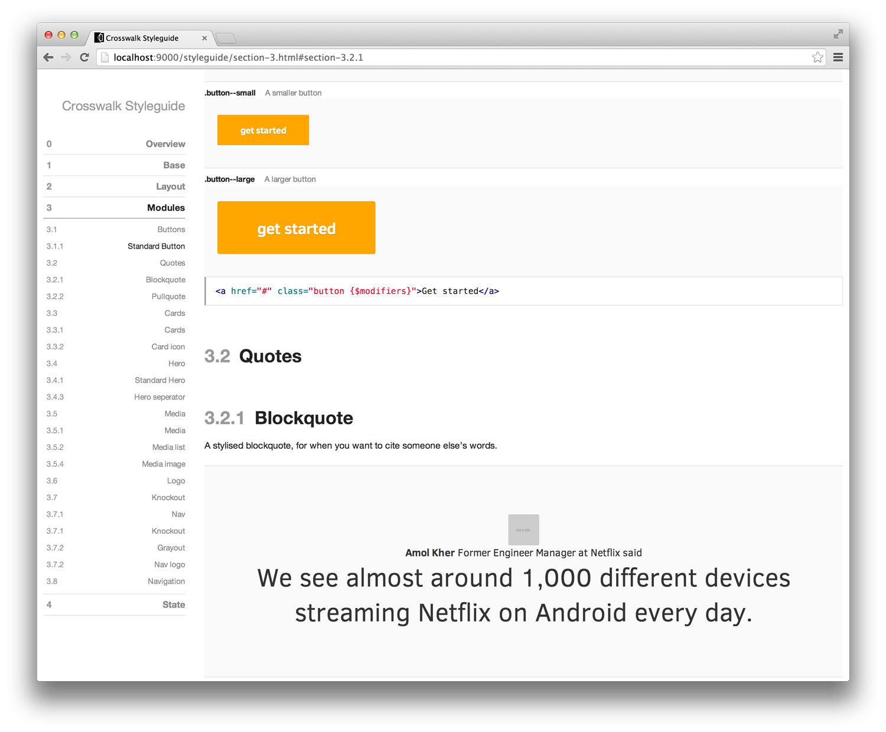

# Intel Crosswalk

Prepared by Chloi Inc. for Troy Allison of Intel.

- Brock Whitten, [brock@chloi.io](mailto:brock@chloi.io)
- Kenneth Ormandy, [kenneth@chloi.io](mailto:kenneth@chloi.io)

## Running locally

This static site for Crosswalk is built using [Harp](http://harpjs.com), the static web server with build-in preprocessing. Harp uses [Node.js](http://nodejs.org), so you will need to install that first. Then, you can use Node.js’s package panager, [npm](http://npmjs.org), to install Harp. Once Node.js is installed, just run the following commands:

```sh
# Install Harp. You may need to preface this command with `sudo`
npm install -g harp

# Clone this project from GitHub
git clone https://github.com/chloi/intel-crosswalk

# Install the project’s dependencies
npm install

# Serve the project
harp server

# The project is now available at http://localhost:9000
```

### Build the Styleguide

This site comes with its markup and CSS modules documented in a Styleguide. It’s comparable to a miniature version of the [documentation for Bootstrap](http://getbootstrap.com/css/), where each module has an example and the accompanying code.

To build the Styleguide, run the following commands:

```sh
# Install dependencies
npm install

# Build the Styleguide
npm run styleguide

# Serve the project
harp server

# Site and Styleguide now available at http://localhost:9000/styleguide
```



What follows below are earlier notes while we planned the project.

## Introduction

Intel aims to lead and advocate for HTML5 development by building HTML5 and hybrid app development tools. Hybrid apps allow developers to build cross-platform applications using HTML, CSS, and JavaScript within a web view: essentially, a full-screen browser without any controls. This is generally done through projects like Cordova, Adobe PhoneGap, or the Intel XDK.

Most developers subject their app to whatever web view is included with the device. This means, when loading a hybrid app on older versions of Android, the app and developer are subject to all the bugs and quirks that come with it.

When you are building a hybrid app without a web view, it’s possible you may get to test for some of these issues, but chances are your app will still exist in a less than ideal frame.

## Opportunity

This is unavoidable on iOS, but with Android it is actually possible to bundle your own with the app, mitigating this uncertainty.

This is the problem the Intel Crosswalk helps to solve, but right now most hybrid app developers are unaware bundling a web view with their application is even an option.

Intel has the opportunity to make Crosswalk the de facto standard for embedding a web view into a hybrid application, in the same way that PhoneGap / Cordova is viewed as the standard for building hybrid apps.

## Objectives

> How might we communicate the full value of the Intel Crosswalk project to developers and designers building hybrid apps for Android, and increase awareness of the project among app developers and decision-makers in general?

With this project, we’ll suggest an answer to what the full value of Crosswalk is, and propose a possible solution to how to communicate this more effectively. 

> How might we make embedding a web view an inherit part of building hybrid apps, with Crosswalk as the obvious or only choice?

Additionally, it appears that Crosswalk is in a similar position as PhoneGap was early on. PhoneGap was actually competing against native platforms, and web developers perception that they needed to switch to writing native code.

Similarly, Crosswalk is really competing against a lack of awareness or understanding that bundling a web view is an option, and against the included native web views themselves.

## Constraints

- Time on research versus implementation
- Existing technical debt on site
- Unforeseen limitations of the product
- Requirements for setting up the product
- Portions of the Crosswalk branding
- Intel branding
- Open source nature
- Maintaining relationships at the expense of promotional opportunities

## What does success look like?

- Increase in visitors. Currently, about 10,000 a month that comes to the Crosswalk site.
- Increase from 165 Twitter followers to at least 1,000
- Increase from 100 email subscribers to at least 1,000
- A better understood, documented, and ongoing approach for communicating the value of Intel Crosswalk

## Audience

Crosswalk’s potential audience is already building hybrid apps, potentially with the Intel XDK but also with PhoneGap, Telerik, or Cordova on its own. They are developers experience with HTML, CSS, and JavaScript, but their skill level and workflow while hybrid apps ranges quite dramatically.

Almost all of them understand that Cordova uses a web view, but are unaware that embedding their own web view is an option. Many of them would like to support as many devices as possible, but only test using new browsers and the devices they have.

These developers might be using Windows, OS X, or Linux to develop apps for Android, and a wide ranging variety of software to actually develop the app.

## Competitive analysis

Crosswalk’s competition isn’t other web views like (the gaming one and the canvas/audio one)—these are its peers. Instead, Crosswalk is competing against a lack of awareness with developers, and against the stock Android browser.

The other web views that might initially appear to be its competition are actually its peers. It will likely be positive for the ecosystem in general if these web views are doing well because there will be a greater expectation that embedding your own web view is the norm.

That said, with this project we’d still like Crosswalk to appear as _the_ option for embedding web views.

## Plan

### Crosswalk research

- How does Crosswalk appear now?
- How is their onboard experience?
- How it their initial experience, esp. through the website?
- How might the on boarding experience be improved?
- What appears to stop people from using it right now?
- What was valuable about it to you, if anything?
- What dependencies existed for our personal installs?

### Iterate

Here, we’ll use what we learned as we research to inform our initial ideas about how Crosswalk’s outward appearance should be improved.

### Execution

Based on the research we’ve done, and the concepts we’ve iterated upon, we’ll implement our initial plan. This will likely take place on the Intel Crosswalk website, but will probably also extend to other parts of Crosswalk’s outward appearance and possibly include suggestions for the product itself.

### Deliverables

- Documented research (clarify: not going to be a book like last time, more like our loose notes in the GitHub repo that we are using for our own internal purposes)
- Improvements we make (Execution section)
- Some documentation from execution phase (Suggestions on how to continue to use the new message to maintain or improve Crosswalk in an ongoing way)

## Questions

If you have any questions, [feel free to email Kenneth](kenneth@chloi.io) or [open an issue on GitHub](https://github.com/chloi/intel-mobile-assessment).
