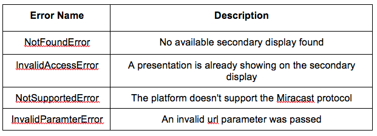

Presentation API Tutorial
=========================

Overview
--------

[Presentation API](http://webscreens.github.io/presentation-api/) is currently a [W3C spec](http://w3c.github.io/presentation-api/) draft for secondary display support for the Web. It allows a web app to present web content on a secondary display connected to the device. It has several uses: presenting slides, sharing video and image, and playing game on a large screen TV via the mobile device.

Presentation API is an experimental feature for Crosswalk for Android 4.2+ based on Miracast-compatible wireless display support. It is available in [current versions](https://crosswalk-project.org/documentation/downloads.html) of Crosswalk.  This tutorial is based on an article from [HTML5 Hub](http://html5hub.com/presentation-api-tutorial/) by Hongbo Min, and has been tested with [Crosswalk Stable 11.40.277.7](https://crosswalk-project.org/documentation/downloads.html).

This initial version of the Presentation API spec is defined as follows:

```
interface Presentation :EventTarget {
 
       void requestShow(DOMString url, successCallback, errorCallback);
       readonly attribute boolean displayAvailable;
       attributeEventHandler ondisplayavailablechange;
};
``` 

In Crosswalk, Presentation API is exposed as an additional property to the navigator object:
	
```  
navigator.presentation.requestShow
 
navigator.presentation.displayAvailable
 
navigator.presentation.displayavailablechange
```

Note: that the Presentation API spec is still evolving, and will be modified to meet new usage scenarios, such as integration with Chromecast devices.

Setup Wireless Display
----------------------

**Requirements**

1. Android 4.2 or newer device with Miracast protocol support.
2. A TV or display with an HDMI port.
3. A Miracast certified wireless display  display adapter, for example the Netgear PTV3000 (tested)
4. Plug the wireless display adapter into the display’s HDMI port.
5. On the Android device, open the ‘Settings’ app and select the ‘Display’ entry.
6. Turn on ‘Wireless display’ to connect to the available wireless display.

**Steps**

Note, that if you have no such wireless display adapter, but are willing to run the application on your device, Android gives you the option to use a simulated secondary display for testing purposes. This simulated display appears as an overlay on your device screen. To enable it:

1. Open the `Settings` app and select `Developer Options`.
2. Use the `Simulate Secondary Display` option to select a display to simulate. 

### Sample Code ###

In the following sample, there are two HTML files:

 * `index.html` – a controller page which shows on the primary display and opens a page on the secondary display
 * `content.html` – the content page to show on the secondary display


> index.html

```
<!DOCTYPE html>
 
<html>
<head>
<script>
var presentationWindow = null;
 
function onsuccess(w) {
  presentationWindow = w;
  w.postMessage("Hello from the opener page", "*");
}
 
function onerror(error) {
  alert("Failed to requestShow: " + error.name);
}
 
function showPresentation() {
  if (!navigator.presentation.displayAvailable) {
    alert("No available display found.");
    return;
  }
 
  navigator.presentation.addEventListener("displayavailablechange", function() {
    if (!navigator.presentation.displayAvailable)
      presentationWindow = null;
  });
  navigator.presentation.requestShow("content.html", onsuccess, onerror);
}
 
window.addEventListener("message", function(event) {
  var msg = event.data;
 
  var elem = document.getElementById(“msg”);
 
  elem.innerHTML= ”Message from secondary display: ” + msg;
});
</script>
</head>
  <body>
  <input type="button" onclick="showPresentation();" value=”Show Presentation”>
  </input>
   
  <div id=”msg”>Message from secondary display: N/A</div>
  </body>
</html>
``` 

> content.html
``` 
<html>
 
<head>
 
<script>
  window.addEventListener("message", function(event) {
    var msg = event.data;
   
    var elem = document.getElementById(“output”);
   
    elem.innerHTML = msg;
    event.source.postMessage("Hello from the secondary display", "*");
  });
</script>
 
</head>
<body>
 
Message from its opener:
 
<div id=”output”>N/A</div>
</body>
</html>
```

Follow the instructions on [how to build a Crosswalk application](https://crosswalk-project.org/#documentation/getting_started/build_an_application) to package the above two HTML files into an Android application; then follow the instructions for [running on Android](https://crosswalk-project.org/documentation/getting_started/run_on_android.html) to launch the application on a Android 4.2+ device. Make sure there is at least one available secondary display before running the application: see the Setup Wireless Display section above.

Once the application is running, clicking the “Show Presentation” button will open the `content.html` page on the secondary display.

You should see the following output on the primary display:

> Hello from the secondary display

and this output on the secondary display:
> Hello from the opener page

If there is no available wireless display, you will get an alert dialog with the message “No available display found”.

For an example of a more realistic HTML5 app using a secondary display, check out the [ImageGallery](https://github.com/crosswalk-project/crosswalk-demos/tree/master/Gallery) demo. This demonstrates how to use the Presentation API to view photos on a wireless display.


### Details of the JavaScript API ###

####`presentation.requestShow Method`####

`requestShow` sends a request to the user agent for to show a presentation. If a secondary display is ready for use, a new presentation window for the HTML page specified by url will be opened on the secondary display. This secondary window is opened from the current browsing context. Once the page has finished loading, the `successCallback` is invoked, taking the window object of the new page as the input parameter. Thus, the communication between the opener window and presentation window follows the approach of [HTML5 Web Messaging](http://www.w3.org/TR/webmessaging/). You can call `postMessage` to post a message and register an `onmessage` event listener to handle the message from the other side.

If one of the following conditions happens, requestShow will fail and the errorCallback is called with an DOMError object. The following table describes the various possible errors:



Note:  Since there is no input channel on the secondary display, we recommend:

1. Design an easy-to-read user interface for a large display, and
2. Avoid JavaScript dialogs, e.g. alert and confirm, and
3. Do not expect click, touch events or keyboard interaction in the presentation page context.

####`presentation.displayAvailable Property`####

It is true if there is at least one secondary display available for showing a presentation; otherwise, it is false. When one secondary display is disconnected:

1. If it is not the only secondary display connected to the device, the page content will be switched to the next available display automatically.
2. If it is the only secondary display, the page content is disposed of, and the `displayAvailable` property set to false.

####`presentation.displayavailablechange Event`####

The `displayavailablechange` event is fired when the first secondary display becomes available or the last secondary display is removed. The property of `displayAvailable` will also be updated to true or false (see above).

The presentation browsing context is closed if the secondary display becomes unavailable. The app does not need to close it.


### Summary ###

In this tutorial, we introduced a new W3C Presentation API for presenting web content on the secondary display, explained the API in detail and how to use it in HTML5 applications. Currently, it is an experimental feature implemented in Crosswalk for Android 4.2+ devices, and may be changed in future for further evolution and feedbacks from community group.


### Resources ###

  * [Crosswalk Open Source Project](https://crosswalk-project.org)
  * [W3C Presentation API Draft](http://webscreens.github.io/presentation-api/)
  * [Second Screen Presentation Community Group](http://www.w3.org/community/webscreens/)
  * [Presentation API Demos for desktop](http://webscreens.github.io/presentation-api/demo/)
  * [Web Screens Mail List](http://lists.w3.org/Archives/Public/public-webscreens/)